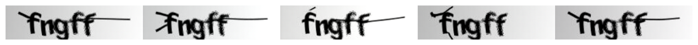
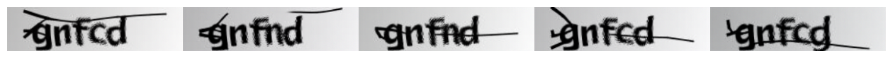

# Diffusion Models - Deep Learning Course

## Repository Overview
This repository contains the implementation of **Diffusion Models** as part of a homework assignment for the Deep Learning course at Sharif University, Spring 2024. The notebook demonstrates the training, evaluation, and generation processes involved in working with diffusion-based generative models.

Diffusion models are a class of generative models that learn to generate data by modeling the reverse of a diffusion process, transforming simple noise into complex data, such as images. This implementation is focused on generating images through a diffusion-based approach.

### Structure
- **`DDPM.ipynb`**: The primary notebook for this homework, implementing and explaining the training and inference processes of diffusion models. This includes denoising, sampling, and visualizing generated images.

### Prerequisites
To run the code, you will need the following:
- Python 3.x
- PyTorch (for model development)
- NumPy (for numerical operations)
- Matplotlib (for visualizing the generated images)
- TQDM (for tracking progress during training)

Install the necessary packages using:
```bash
pip install torch numpy matplotlib tqdm
```

## Detailed Explanation of the Diffusion Model

### What is a Diffusion Model?
Diffusion models work by transforming data, such as images, into random noise through a forward process, and then learning a reverse process that gradually converts noise back into the original data. In this way, they can generate new samples from random noise, similar to how GANs and VAEs work, but with a focus on the iterative denoising process.

- **Forward Process**: Data is progressively "diffused" by adding noise over several steps, until the data resembles pure noise.
- **Reverse Process**: The model is trained to reverse the diffusion process, starting from noise and removing noise step-by-step to reconstruct the original data.

### Model Architecture
The core of the diffusion model is built around the following components:
- **Noise Schedule**: Defines how noise is added to the data over multiple steps in the forward process.
- **Denoising Network**: A neural network trained to predict and remove noise at each step of the reverse process, gradually reconstructing the original image.

### Training Process
The training procedure for diffusion models involves:
1. **Noise Addition**: At each time step, a small amount of noise is added to the data, gradually corrupting the image.
2. **Denoising Model**: The model learns to predict and remove the added noise at each step, effectively reversing the diffusion process.
3. **Objective**: The model is trained to minimize the difference between the true noise and the predicted noise at each time step.

The notebook includes the following key sections:
- **Data Loading**: Load and preprocess the dataset, which is typically image data (e.g., MNIST, CIFAR-10).
- **Noise Scheduling**: Define the schedule of noise to be added at each step.
- **Model Training**: Train the denoising network to recover the original image by reversing the diffusion process.
- **Evaluation**: After training, the model is used to generate new images by reversing the diffusion process from pure noise.

### Sampling
Once the model is trained, new images can be generated by sampling from a noise distribution and iteratively denoising using the trained model. This process starts with pure noise and follows the learned reverse diffusion process to create realistic samples.

## Results
Here are some of the results generated by the diffusion model during training:

### Generated Image: "fngff"


### Generated Image: "gnfcd"


These images demonstrate how the model can reconstruct characters and words from random noise, showcasing the effectiveness of diffusion models in generating coherent outputs.

## How to Run the Notebook
1. Clone the repository:
```bash
git clone https://github.com/AqaPayam/Diffusion_Models_DeepLearning_Course.git
```

2. Navigate to the project directory:
```bash
cd Diffusion_Models_DeepLearning_Course
```

3. Run the Jupyter notebook:
```bash
jupyter notebook DDPM.ipynb
```

4. Execute the cells to train the model, visualize the results, and generate new samples.

## Contribution
Contributions are welcome! If you have ideas for improving the model, experimenting with different datasets, or extending the implementation to more complex tasks, feel free to fork the repository and create a pull request.

## License
This project is licensed under the MIT License.
